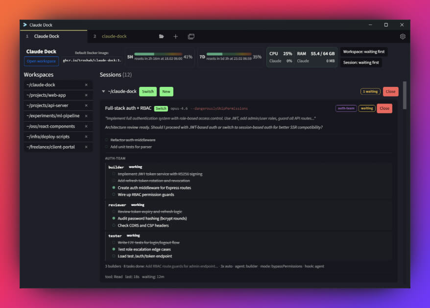
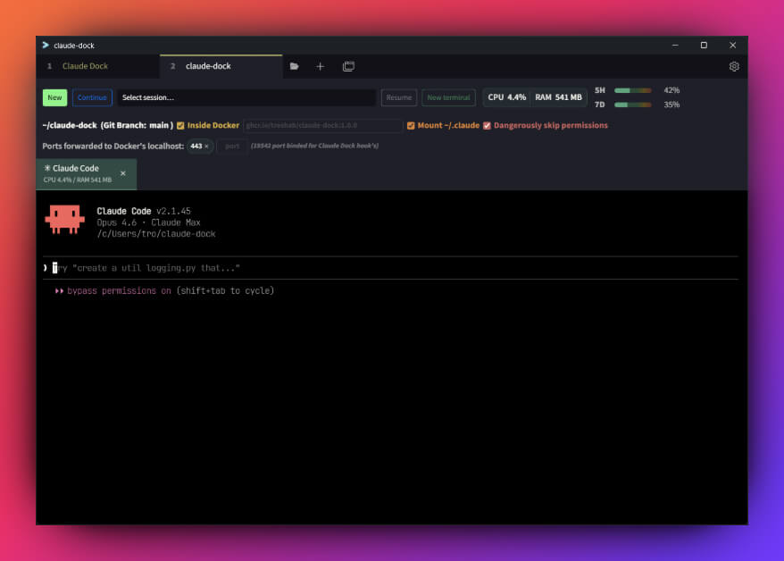

# Claude Dock

[Tabby](https://github.com/Eugeny/tabby) plugin that adds:

- Pinned **Claude Dock Dashboard** tab (singleton).
- **Workspace** tabs (one per project directory).
- Per-workspace **terminal sub-tabs** (opened with `cwd = workspace.cwd`).
- Claude Code **sessions list** (working/waiting) driven by Claude hooks (realtime via TCP).
- Claude **usage** panel (reads `~/.claude/stats-cache.json`).





## Install

```bash
npm i -g @troshab/claude-dock
```

This single command builds the plugin, deploys Claude Code hooks, and links into Tabby.

Restart Tabby to activate.

## What the install does

- Copies `bin/claude-dock-hook.js` to `~/.claude/plugins/cache/claude-dock/`
- Patches `~/.claude/settings.json` (creates a timestamped `.bak-*` backup) with hooks:
  - `SessionStart`, `PreToolUse`, `PostToolUse`, `Stop`, `Notification`, `SessionEnd`
- Links the Tabby plugin into `<tabby-plugins>/node_modules/tabby-claude-dock`

Events are delivered in realtime via TCP to `127.0.0.1:19542`.
Docker containers send events to `host.docker.internal:19542`.
